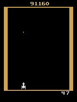
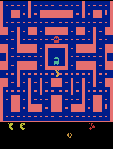
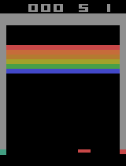

# DRLA Atari

Trains a deep reinforcement learning agent in Atari environments with the [DRLA](https://github.com/benborder/drla) library.



## Installation

Install libtorch at `/usr/local/libtorch` and ensure cmake is also installed.

```bash
cmake --preset release
cmake --build --preset release --target install --parallel 8
```

### Dependencies

All below dependencies are fetched automatically via cmake fetch content.

- [drla](https://github.com/benborder/drla)
- [nlohmann-json](https://github.com/nlohmann/json)
- [spdlog](https://github.com/gabime/spdlog)
- [ALE](https://github.com/mgbellemare/Arcade-Learning-Environment)
- [cxxopts](https://github.com/jarro2783/cxxopts)
- [fmt](https://github.com/fmtlib/fmt)
- [GifEncoder](https://github.com/xiaozhuai/GifEncoder)
- [lodepng](https://github.com/lvandeve/lodepng)
- [tensorboard_logger](https://github.com/RustingSword/tensorboard_logger)
- Atari Roms - The user can set the ROMS url via the cmake variable `ROMS_URL`. It is up to the user to obtain the URL or ROMS themselves.

## Training

To run training pass the config json file and the path to store the training data:

```bash
../install/drla-atari/bin/atari_train --config /path/to/config.json --data /path/to/data/directory/
```

An example config can be found [here](doc/config-example.jsonc).

The performance of running 16 envs on a AMD Ryzen 9 5950X and nVidia RTX 3080 Ti is ~5000fps.

## Monitoring training

Run [Tensorboard](https://github.com/tensorflow/tensorboard) to view current and previous training runs:

```bash
tensorboard --max_reload_threads 4 --load_fast=false --bind_all --logdir /path/to/data/directory/
```

Goto http://localhost:6006 to view webpage.

## Running an agent

A trained agent can be run via:

```
../install/drla-atari/bin/atari_run --data /path/to/data/directory/
```

The final score will be printed out in the terminal. To save a gif as well add the `--save_gif` arg.
